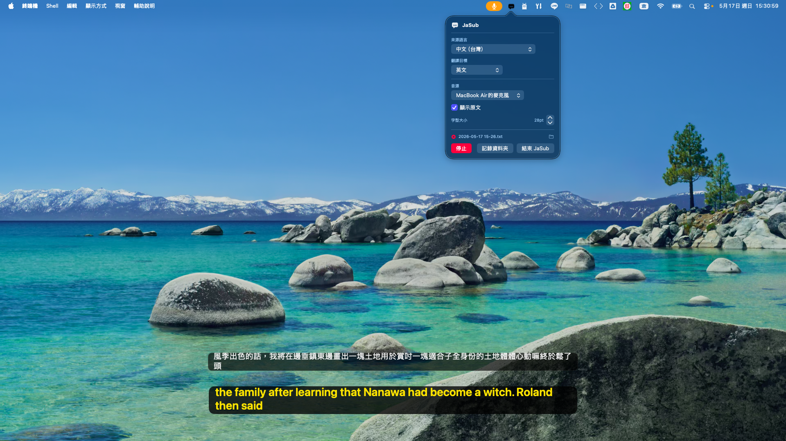
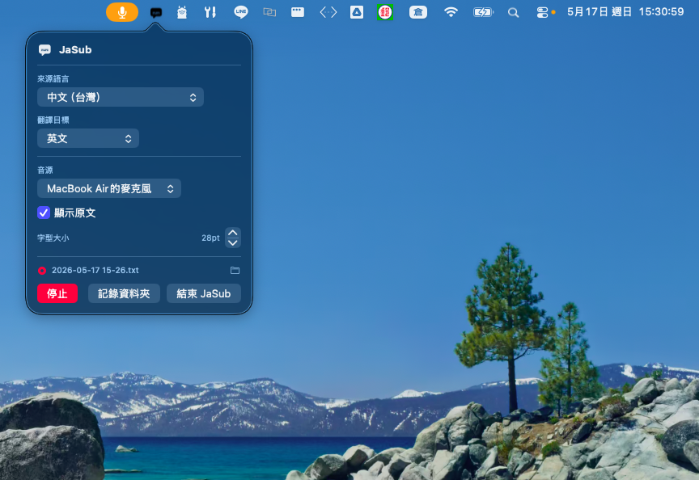

# JaSub — Real-Time Meeting Transcription & Translation

Fully on-device, real-time speech transcription and translation for macOS 26+. No cloud, no API keys, no subscription.

Uses Apple's native stack exclusively:

- **ASR**: SpeechAnalyzer + SpeechTranscriber (Speech.framework, macOS 26+)
- **Translation**: Translation.framework (< 100ms) → FoundationModels / Apple Intelligence (fallback, ~500ms)
- **System audio**: CATapDescription + IOProc — captures browser or any app audio without a virtual audio driver

## Download

**[→ JaSub 0.2.0 (DMG)](https://github.com/ultima6-tw/livesub-macos/releases/latest)**

> Requires macOS 26 (Tahoe) + Apple Intelligence + Apple Silicon.  
> First launch: right-click the app → **Open** to bypass Gatekeeper.



---

## Menu Bar App

A native SwiftUI menu bar app with floating subtitle overlay windows.

### Requirements

- macOS 26+ (Tahoe) with Apple Intelligence enabled
- Apple Silicon Mac
- Xcode 26+ (`xcode-select --install` or full Xcode)
- [xcodegen](https://github.com/yonaskolb/XcodeGen) (`brew install xcodegen`)

### Install translation language packs (required)

**System Settings → General → Language & Region → Translation Languages**

Install the language pairs you need (e.g. English ↔ Chinese, Japanese ↔ Chinese). Required for < 100ms translation. Without this the app uses FoundationModels (~500ms), which is still fully on-device.

### Build and install

```bash
cd app
./setup.sh        # install xcodegen and generate .xcodeproj (first time only)
./package.sh      # Release build → dist/JaSub-0.2.0.dmg
```

Open the DMG, drag JaSub to Applications, then right-click → **Open** on first launch (bypasses Gatekeeper — the app is ad-hoc signed, not notarised).

### Usage

| Action | Result |
|--------|--------|
| Left-click menu bar icon | Open settings popover (language, audio source, font size) |
| Right-click menu bar icon | Quick menu: Start / Stop / Quit |
| Icon turns red | App is running — click to access Stop |



### Features

| Feature | Details |
|---------|---------|
| Source language | Dynamically queried from `SFSpeechRecognizer.supportedLocales()` |
| Target language | Dynamically queried from `Translation.framework`, installed packs listed first |
| Language names | Localised to system display language |
| Audio source | Microphone (CoreAudio device list) or Browser / System Audio (CATapDescription + IOProc) |
| Font size | 12–40pt stepper, persisted across launches — subtitle windows are freely resizable |
| Show original | Toggle original-language subtitle window |
| Session log | Auto-creates `~/Documents/JaSub/YYYY-MM-DD HH-mm.txt` on start, appends each sentence in real time |
| Log folder | Opens `~/Documents/JaSub` in Finder |


> Both subtitle windows can be freely resized by dragging any edge or corner. Font size (12–40pt) is controlled from the settings popover and persisted across launches.

### Permissions

- **Speech Recognition** — prompted on first start
- **Screen & System Audio Recording** — required for browser audio capture (System Settings → Privacy & Security → Screen Recording)

---

## Architecture

```
Microphone
    ↓ AVAudioEngine (16kHz mono float32)
    ↓ AsyncStream<[Float]>

Browser / System Audio
    ↓ CATapDescription + IOProc (48kHz → resample → 16kHz)
    ↓ AsyncStream<[Float]>

SpeechAnalyzer + SpeechTranscriber  [ASRManager]
    partial → live subtitle update
    final   → hallucination filter → translation queue

Translation.framework  [TranslatorManager]
    ① Translation.framework  (< 100ms, installed language pack)
    ② FoundationModels fallback  (Apple Intelligence 3B, ~500ms)
       guardrail → completion-style retry → ⚠ original text

@MainActor TranslationEngine → SwiftUI floating NSPanel windows
```

---

## Why SpeechAnalyzer?

`SpeechAnalyzer` (macOS 26+) is Apple's API for continuous live transcription. No session time limit, progressive partial results, fully Neural Engine, automatic model download.

**Evolution**: mlx-whisper → WhisperKit → SFSpeechRecognizer → **SpeechAnalyzer**. WhisperKit with `--use-prefill-prompt` invalidated the Neural Engine cache (7–10s/segment). SFSpeechRecognizer was superseded when SpeechAnalyzer shipped in macOS 26.

---

## Known Limitations

**Music / singing**: SpeechAnalyzer is speech-optimised. Some lyrics are recognised but gaps are expected.

**Proper nouns**: No hot-words API — character names and technical terms may be phonetically substituted.

---

## CLI version (legacy, no longer actively developed)

A Python + Swift CLI version is available in `server/` for headless or terminal use. No further development planned — the Menu Bar App is the primary version.

```bash
./run.sh    # auto-setup + interactive menu (language pair + audio source)
```

Requires Python 3.13+ and Xcode Command Line Tools. See `NOTES.md` for architecture details and known issues.
